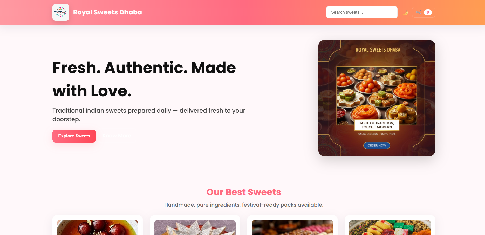
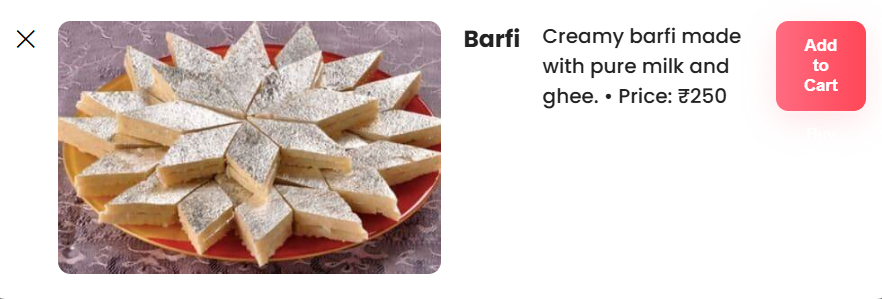
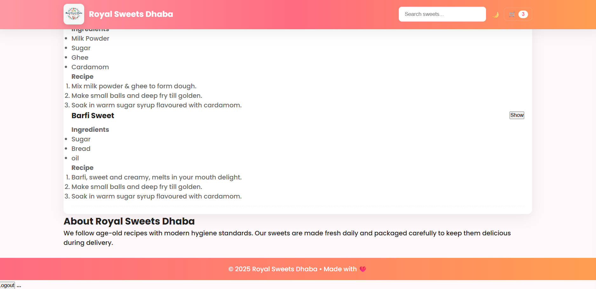

🍬 Royal Sweets Dhaba (HTML & CSS)
🔍 Overview

Royal Sweets Dhaba is a simple and visually appealing static website designed using HTML and CSS. It showcases traditional Indian sweets like Gulab Jamun and Barfi, along with their ingredients and recipes. The project focuses on clean design, easy navigation, and a colorful theme that reflects the vibrant Indian sweet culture.

✅ Features

✔ Homepage with Navigation Menu – Links to Home, Login, Contact, About
✔ Sweet Sections – Displays sweets like Gulab Jamun and Barfi with:

Ingredients list

Recipe steps
✔ High-quality Images – Attractive images of sweets
✔ Gradient Background & Modern UI – Eye-catching design with vibrant colors

🛠 Technologies Used

HTML5 – For content structure

CSS3 – For styling and layout

Gradient backgrounds

Text formatting

Image styling with shadow and rounded edges

📸 Preview

📂 How It Works

Homepage displays sweets with ingredients and recipes.

Navigation bar for easy access to other sections (Home, Login, Contact, About).

Simple static design, no backend functionality.

📌 Use Cases

Beginner Frontend Project – Perfect for learning HTML & CSS basics.

Restaurant/Hotel Landing Page – Can be adapted for real businesses.

Portfolio Showcase – Great for demonstrating web design skills.

🚀 Future Enhancements

✅ Add responsive design for mobile and tablet devices.

✅ Implement login form with basic validation.

✅ Add contact form for user inquiries.

✅ Include JavaScript for interactivity (like dynamic menus, image sliders).

